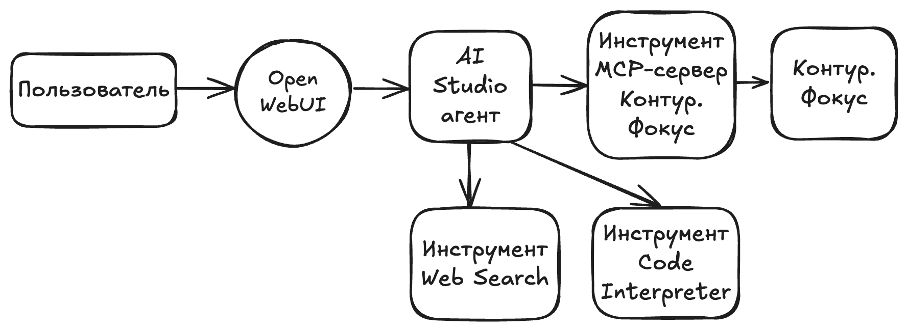

# ИИ-помощник для проверки контрагентов

# 1. Введение

В этом решении вы развернете ИИ-помощника для проверки контрагентов на основе данных из Контур.Фокус и публичных сайтов.
По результатам проверки будет подготовлен отчет, доступный для скачивания в формате Word.    

В решении будут использованы сервисы Yandex Cloud:
- [AI-агент AI Studio](https://yandex.cloud/ru/docs/ai-studio/concepts/agents/) для общения с пользователем, обращения к LLM-модели, вызова других инструментов AI Studio;
- [MCP-сервер Контур.Фокус](https://aistudio.yandex.ru/docs/ru/ai-studio/concepts/mcp-hub/templates.html#kontur) для получения информации из [Контур.Фокус](https://focus.kontur.ru/) о контрагенте и экспресс-отчета о его состоянии, а также оценку его благонадежности по нескольким критериям;
- [Инструмент веб-поиска Web Search](https://aistudio.yandex.ru/docs/ru/ai-studio/concepts/agents/tools/websearch.html) для поиска информации о контрагенте на публичных сайтах;
- [Инструмент Code Interpreter](https://aistudio.yandex.ru/docs/ru/ai-studio/concepts/agents/tools/code-interpreter.html) для формирования отчета в формате Word.

# 🧱 2.Архитектура решения



Описание элементов схемы:

| **Сервис**                         | **Назначение**                                                                                                                                                                                                                                                                                          |
| :--------------------------------- | :------------------------------------------------------------------------------------------------------------------------------------------------------------------------------------------------------------------------------------------------------------------------------------------------------ |
| AI Studio агент                    | AI-агент в AI Studio, реализующий бизнес-логику проверки контрагента в соответствии с инструкцией. К агенту подключены инструменты: MCP-сервер для работы с Контур.Фокус, Web Search, Coder Interpreter.                                                                                                |
| Инструмент MCP-сервер Контур.Фокус | [MCP-сервер Контур.Фокус](https://aistudio.yandex.ru/docs/ru/ai-studio/concepts/mcp-hub/templates.html#kontur) для получения информации из [Контр.Фокус](https://focus.kontur.ru/) о контрагенте и экспресс-отчета о его состоянии, а также оценки его благонадежности по нескольким критериям. |
| Контур.Фокус                       | [Контур.Фокус](https://focus.kontur.ru/) — облачный сервис от СКБ Контур для проверки контрагентов и оценки их надёжности.                                                                                                                                                                              |
| Инструмент Web Search              | [Инструмент веб-поиска Web Search](https://aistudio.yandex.ru/docs/ru/ai-studio/concepts/agents/tools/websearch.html) — встроенный инструмент AI Studio для поиска информации о контрагенте на публичных сайтах.                                                                                        |
| Инструмент Code Interpreter        | [Инструмент Code Interpreter](https://aistudio.yandex.ru/docs/ru/ai-studio/concepts/agents/tools/code-interpreter.html) — встроенный инструмент AI Studio, позволяющий модели писать и выполнять Python-код для формирования отчета о контрагенте в формате Word.                                       |
| Open WebUI                         | [Open WebUI](https://github.com/open-webui/open-webui) — Open-Source веб-интерфейс для работы с LLM. Он позволяет общаться с моделями через удобный чат-интерфейс, подключать разные модели и провайдеров, а также использовать агентов и инструменты.                                                  |
# ⚙️ 3. Подготовка окружения

## Подготовка облака

Зарегистрируйтесь в Yandex Cloud и создайте [платежный аккаунт](https://yandex.cloud/ru/docs/billing/concepts/billing-account):
1. Перейдите в [консоль управления](https://console.yandex.cloud/), затем войдите в Yandex Cloud или зарегистрируйтесь.
2. На странице [**Yandex Cloud Billing**](https://center.yandex.cloud/billing/accounts) убедитесь, что у вас подключен платежный аккаунт, и он находится в [статусе](https://yandex.cloud/ru/docs/billing/concepts/billing-account-statuses) `ACTIVE` или `TRIAL_ACTIVE`. Если платежного аккаунта нет, [создайте его](https://yandex.cloud/ru/docs/billing/quickstart/) и [привяжите](https://yandex.cloud/ru/docs/billing/operations/pin-cloud) к нему облако.

Если у вас есть активный платежный аккаунт, вы можете создать или выбрать [каталог](https://yandex.cloud/ru/docs/resource-manager/concepts/resources-hierarchy#folder), в котором будет работать ваша инфраструктура, на [странице облака](https://console.yandex.cloud/cloud).
[Подробнее об облаках и каталогах](https://yandex.cloud/ru/docs/resource-manager/concepts/resources-hierarchy).
Для развертывания решения у пользователя должна быть роль `admin` в каталоге.

## Создание сервисного аккаунта и API-ключа

[Создайте сервисный аккаунт](https://yandex.cloud/ru/docs/iam/operations/sa/create) с именем `sa-agent-contractor-check` для интеграции агента в ваши сервисы и приложения (например, Open Web UI) и [назначьте ему роли](https://yandex.cloud/ru/docs/iam/operations/sa/assign-role-for-sa) на ваш каталог: `ai.assistants.editor`, `ai.languageModels.user`, `serverless.mcpGateways.invoker`.
[Создайте API-ключ](https://yandex.cloud/ru/docs/iam/operations/authentication/manage-api-keys#create-api-key) для сервисного аккаунта `sa-agent-contractor-check` с областями действия `yc.ai.foundationModels.execute` и `yc.serverless.mcpGateways.invoke`. 

Упрощенный способ создания сервисного аккаунта и API-ключа (с более широкими правами доступа) приведен в [документации](https://aistudio.yandex.ru/docs/ru/ai-studio/operations/get-api-key.html).

# ☁️ 4. Развёртывание инфраструктуры

## Создание MCP-сервера

[Создайте MCP-сервер](https://yandex.cloud/ru/docs/ai-studio/operations/mcp-servers/create-from-template) в MCP Hub из шаблона для взаимодействия AI-агента с Контур.Фокус:

1. В платформе **AI Studio** выберите на панели слева **MCP-серверы** и нажмите **Создать MCP-сервер**.
2. В блоке **Шаблоны MCP-серверов** выберите шаблон **Контур.Фокус**.
3. В поле **Имя** укажите `contractor-check-kontur-focus`.
4. Включите **Запись логов** по желанию.
5. Нажмите **Создать**.
6. В поле **key** добавьте значение Вашего расширенного ключа доступа Контур.Фокус. Если у Вас еще нет расширенного ключа доступа или Вы планируете только познакомиться с возможностями Контур.Фокуса, то используйте указанный [на сайте Контур.Фокуса](https://developer.kontur.ru/doc/focus?about=2) для тестирования с ограниченной функциональностью.
7. В блоке **Инструменты** нажмите **Выбрать все**.
8. Нажмите **Сохранить**.

## Создание AI-агента

[Создайте AI-агента](https://aistudio.yandex.ru/docs/ru/ai-studio/operations/agents/create-agent-ui.html) в AI Studio, который реализует бизнес-логику проверки контрагента на основе инструкции и использует подключенные инструменты MCP-сервера для Контур.Фокус, Web Search и Code Interpreter:

1. В платформе **AI Studio** выберите на панели слева **Агенты** и нажмите **Создать агента**.
2. В поле **Имя** укажите `contractor-check`.
3. В поле **Модель** выберите `Qwen3.6-35B`.
4. В поле **Формат ответа** оставьте `Текст`.
5. В поле **Температура** оставьте `0.3`.
6. В поле **Режим рассуждений** оставьте `Авто`.
7. В поле **Максимум токенов в ответе** укажите `7000`.
8. В поле **Инструкция** опишите, как агент должен себя вести и что должен делать, например:

```
# Роль
Ты — профессиональный аналитик по проверке юридических лиц и ИП. 

# Твои задачи:
- Собирать и структурировать информацию о контрагентах по ИНН
- Предоставить пользователю подробный, достоверный и структурированный отчёт о контрагенте на основе данных из инструмента MCP-сервер Контур.Фокус
- Дополнить информацию о контрагенте на основе открытых источников, используя инструмент Web Search

# Входные данные:
- Значение ИНН из 10 или 12 цифр из таблиц:

## Юридические лица
| № | ИНН | Наименование |
|---|-----|-------------|
| 1 | 6663003127 | АО "ПФ "СКБ Контур" (Производственная Фирма "СКБ Контур") |
| 2 | 7708503727 | ОАО "РЖД" (Российские железные дороги) |
| 3 | 7736050003 | ПАО "Газпром" (Публичное акционерное общество "Газпром") |
| 4 | 7452027843 | ООО "ЧТЗ-УРАЛТРАК" (Челябинский тракторный завод-УРАЛТРАК) |
| 5 | 6658021579 | Правительство Свердловской области |
| 6 | 7725604637 | ООО "Ромашка" |
| 7 | 4401006984 | ОАО "Костромской завод Мотордеталь" |
| 8 | 3016003718 | ОАО "Русская Икра" |
| 9 | 5053051872 | ООО "РДП" |

## Индивидуальные предприниматели
| № | ИНН | ФИО | Статус |
|---|-----|-----|--------|
| 1 | 561100409545 | Иванов Иван Иванович |
| 2 | 666200351548 | Ковпак Лев Игоревич | 
| 3 | 366512608416 | Введенский Михаил Сергеевич |
| 4 | 773173084809 | Шеховцов Владимир Олегович |
| 5 | 771409116994 | Подсекальников Андрей Владимирович |
| 6 | 503115929542 | Двойнева Светлана Валерьевна |
| 7 | 773400211252 | Барков Геннадий Владимирович |
| 8 | 771902452360 | Корчагин Павел Викторович |
| 9 | 702100195003 | Зенкин Андрей Николаевич |


# Выходные данные:
- При вопросе пользователя о твоих возможностях выдавай краткую информацию и список ИНН, которые можно использовать
- Ответ должен содержать отчет с полной информацией о контрагенте в формате Word файла, созданного с использованием инструмента Code Interpreter
- После создания Word файла сообщи пользователю только, что  подробный отчет готов по запрошенному ИНН и компании, который пользователь может скачать в виде Word файла, раскрыв "Источники" в интерфейсе Open WebUI 
- В ответе пользователю не указывай ссылки на скачивание отчета в формате Word
```

9. В поле **Инструменты** нажмите **Добавить** и выберите **MCP**. 
10. Поставьте чекбокс для `contractor-check-kontur-focus` и нажмите **Выбрать**.
11. В поле **Инструменты MCP-сервера** нажмите **Настроить**. 
12. В поле **Поведение по умолчанию для всех инструментов** выберите **Без подтверждения**.
13. Нажмите **Сохранить**.
14. В поле **Инструменты** нажмите **Добавить** и выберите **Web Search**. 
15. В поле **Размер контекста поиска** выберите **Medium**.
16. Включите переключатель **Ограничить область поиска**.
17. В поле **Регион** выберите **225 - Россия**.
18. В поле **Домены** нажмите **Добавить** и укажите публичный сайт, по которому требуется искать информацию о контрагенте. Поддерживается добавление до 5 доменов. Например, добавьте следующие домены:
	- `https://www.nalog.gov.ru`
	- `https://www.kommersant.ru`
	- `https://tass.ru/`
19. В поле **Инструменты** нажмите **Добавить** и выберите **Code Interpreter**. 
20. Нажмите **Сохранить**.
21. Сохраните значение поля **Идентификатор** агента `contractor-check` - он потребуется в дальнейшем.

## Подключение AI-агента к Open WebUI

Для подключения агентов, созданных в AI Studio к Open WebUI используется функционал [Functions](https://docs.openwebui.com/features/extensibility/plugin/functions/) в Open WebUI. Через данный функционал реализован "адаптер" между Open WebUI и Yandex AI Studio Agents.
1. Зайдите в **Панель администратора** (**Admin Panel**) и выберите вкладку **Функции** (**Functions**). 
2. Нажмите **Новая функция** (**New Functions**) и выберите **Новая функция**. Удалите дефолтный код и вставьте код из [репозитория](https://github.com/yandex-cloud/yandex-ai-studio-sdk/blob/7a70da45a95f9d327779170d6273292ef5d0f19d/open-webui/aistudio-agents/aistudio-agents.py).
3. Задайте название `contractor-check-agent` и описание функции.
4. Нажмите **Сохранить**, подтверждая свои действия.
5. Вернитесь в раздел **Функции**. Нажмите на символ шестеренки для созданной функции для ее настройки и укажите:
    - В поле **Yandex Cloud Api Key** укажите API-ключ созданного сервисного аккаунта;
    - В поле **Yandex Cloud Folder Id** укажите ID вашего каталога в AI Studio;
    - В поле **Agents Ids** укажите идентификатор агента `contractor-check`, созданного в AI Studio;
    - В поле **Agent Names** укажите имя агента, которое будет отображаться в Open WebUI, например, **Проверка контрагента**;
    - Нажмите **Сохранить (Save)**.
6. Вернитесь в раздел **Функции** (**Functions**) и с помощью переключателя включите созданную функцию.
7. Зайдите в **Панель администратора** (**Admin Panel**) и выберите вкладку **Настройки** (**Settings**). В списке настроек выберите **Модели** (**Models**).
8. Перейдите в редактирование созданной функции (агента) и укажите:
	- В поле **Описание (Description)** укажите, например: `Выполняет по ИНН проверку контрагентов, используя Контур.Фокус и публичную информацию с сайтов`;
	- В разделе **Возможности (Capabilities)** оставьте включенными только следующие флажки: **Загрузка Файла (File Upload)**, **Цитаты (Citations)**, **Обновления Статуса (Status Updates)**. Остальные отключите;
	- Нажмите **Сохранить и обновить (Save & Update)**.

**Примечание:**
- В Open WebUI файлы с отчетами о контрагентах в формате Word доступны по ссылкам, которые появятся в разделе **Источники** (**Sources**) в окне вашего чата после выполнения запроса. Также эти файлы сохраняются в [файловое хранилище](https://aistudio.yandex.ru/docs/ru/ai-studio/operations/agents/files-upload-ui.html) в AI Studio. 
- Использование инструментов, подключенных к агенту возможно в Open WebUI, но управление всеми инструментами, подключенными к агенту осуществляется из AI Studio. Например, если к агенту в AI Studio подключен поиск по интернет через инструмент Web Search, то добавление/удаление доменов для поиска осуществляется через AI Studio, а не в Open WebUI.

# 🧪 5. Тестирование решения

Протестируйте работу ИИ-агента в интерфейсе Open WebUI:
1. В интерфейсе Open WebUI в левой панели выберите **Новый чат (New Chat)**. 
2. В верхнем левом углу в списке моделей появится возможность выбрать созданного агента из AI Studio.
3. Отправьте в чат сообщение:

```
Что ты умеешь делать
```

3. Агент ответит с краткой информацией о своих возможностях.
4. Отправьте в чат ИНН контрагента, по которому необходимо предоставить информацию. Список ИНН для тестирования указан [на сайте Контур.Фокуса](https://developer.kontur.ru/doc/focus?about=2). Например:

```
7736050003
```

5. Агент начнет проверку. Дождитесь сообщения в чате от агента о готовности отчета. Отчет в формате Word можно скачать по ссылке, которая находится в разделе **Источники** (**Sources**) в окне вашего чата после сообщения от агента о готовности отчета.

# 🧹 6. Очистка ресурсов

Чтобы перестать платить за созданные ресурсы:
- Удалите AI-агента:
    - В консоли управления в списке сервисов выберите **Yandex AI Studio**;
    - На панели слева выберите **Агенты**;
    - У агента `contractor-check-agent` нажмите `...` и выберите **Удалить**;
    - Введите идентификатор агента для подтверждения удаления;
- Удалите MCP-сервер:
    - В **AI Studio** на панели слева выберите **MCP-серверы**;
    - У сервера `contractor-check-kontur-focus` нажмите `...` и выберите **Удалить**;
    - Введите `contractor-check-kontur-focus` для подтверждения удаления;
- Если вы включали опцию записи логов MCP-сервера, [удалите](https://yandex.cloud/ru/docs/logging/operations/delete-group) лог-группу.
- [Удалите](https://yandex.cloud/ru/docs/iam/operations/sa/delete) сервисный аккаунт.
